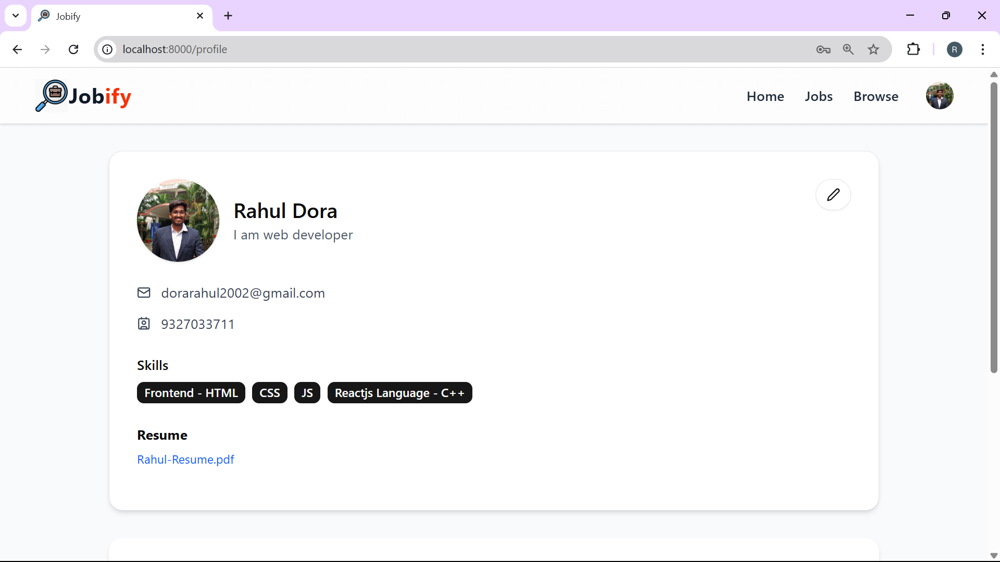
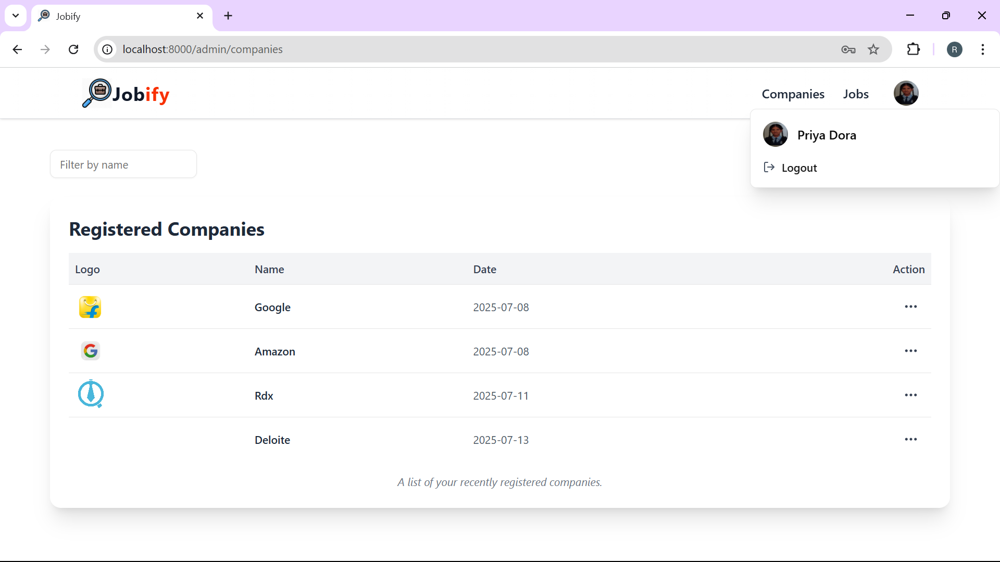
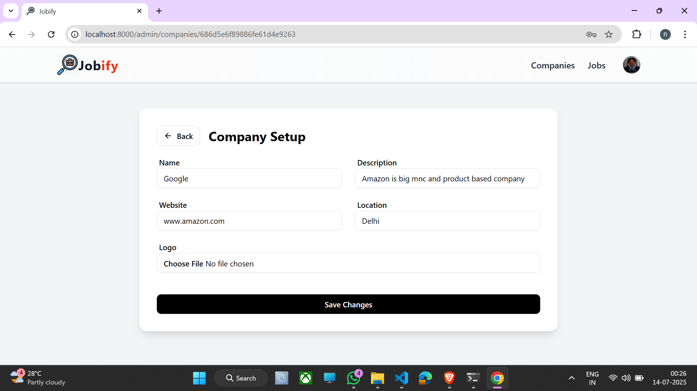

# 💼 Jobify – Modern Job Portal Application

**Jobify** is a full-stack job portal web application that helps job seekers find and apply to jobs, while allowing recruiters to post, manage, and track applications with ease. It features an intuitive UI, dynamic search/filtering, and real-time application tracking.

---

## 🔗 Live Application

🌐 [Click here to explore Jobify](https://jobify-app-g41j.onrender.com/)

---

## 🚀 Features

### 👩‍💼 For Job Seekers (Students)
- Browse and search for jobs with dynamic filters
- Apply to jobs with one click
- Track application status in real-time
- Create and update user profile

### 🧑‍💼 For Recruiters (Admins)
- Create and manage companies
- Post job openings and edit or delete them
- View and manage applicants for each job
- Update application status (Accepted / Rejected / Under Review)

---

## 🖼️ Screenshots

Below are the screenshots of all main pages:

###  Home Page  

 

###  Lastest Job Page  

 

###  Footer Page  

 

###  Browse 

 

###  Profile Page  

 

 

###  Profile Applied Page  

 

###  Profile Popover 

 

### 🔐 Login Page  

 

### 📝 Signup Page  

 

###  All Jobs Page  

 

###  Admin Companies  

 

 

###  Admin Profile  

 

###  Posted job Page  

 

 

###  Posted job Action  

 

 

###  Applicants Page  

 

 

###  Applicants Action Page   

 

 

###  New Company Page   

 

 

###  New Job Page   

 

 

###  Company Setup page  

 

 

###  Company Edit page  

 

---

## 🛠️ Tech Stack

### 🔷 Frontend
- React.js (with React Router)
- Tailwind CSS
- Axios
- Redux Toolkit
- Framer Motion (for animations)
- Shadcn

### 🔶 Backend
- Node.js
- Express.js
- MongoDB (Mongoose)
- Cloudinary (for image uploads)
- Multer
- Cookie-based Authentication

